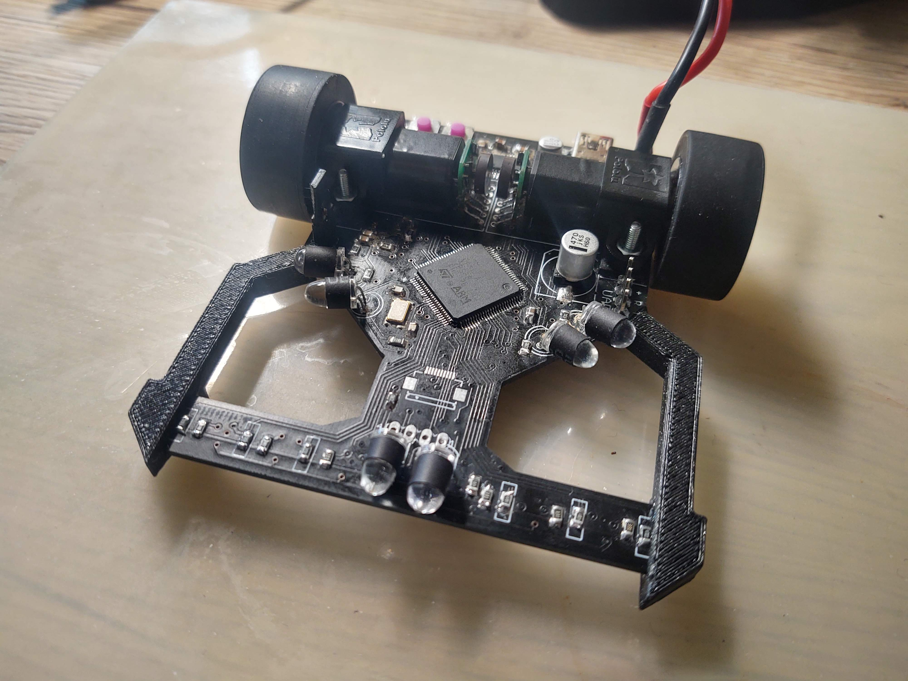
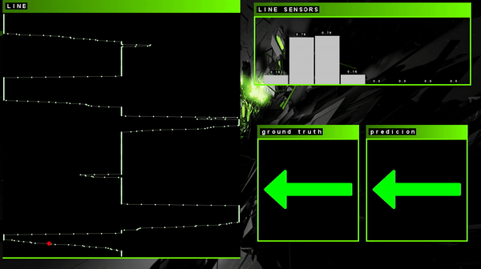
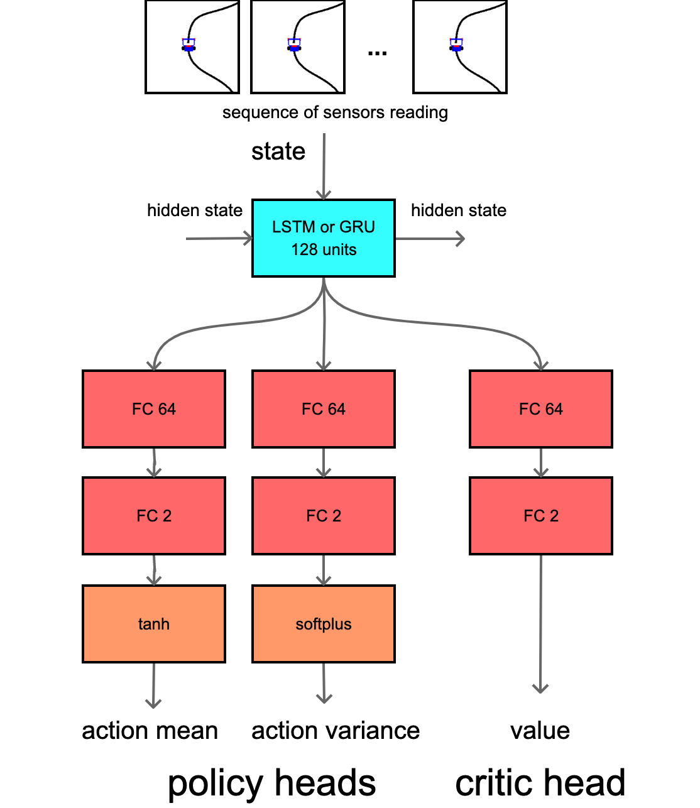
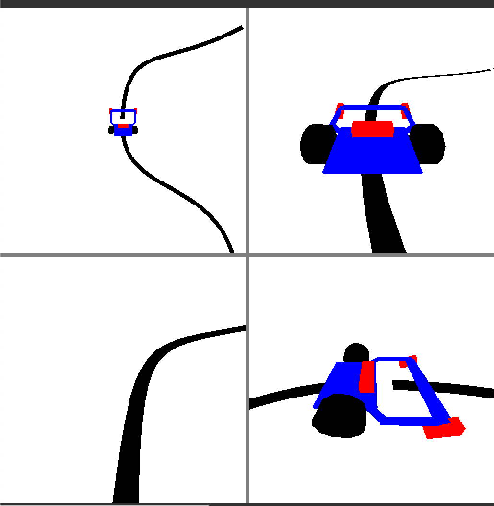
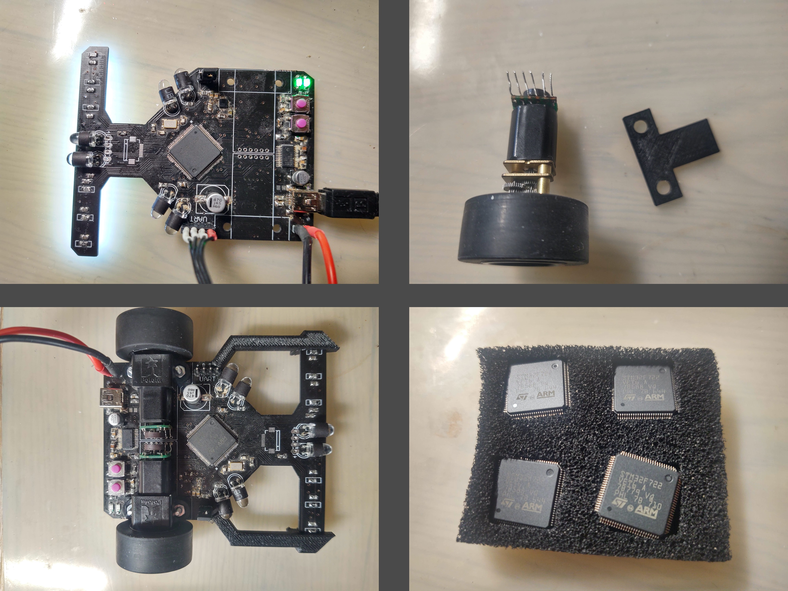
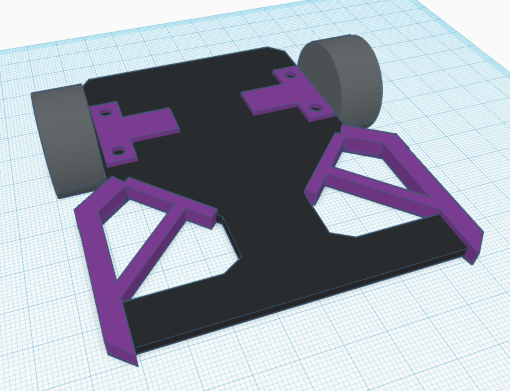
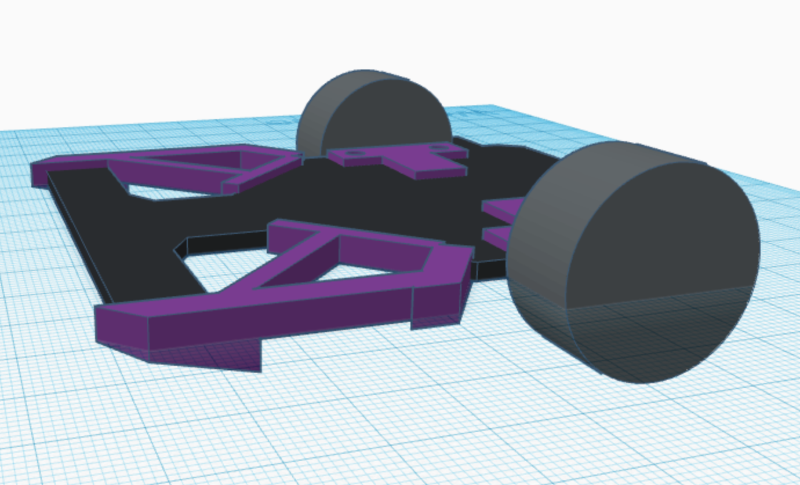
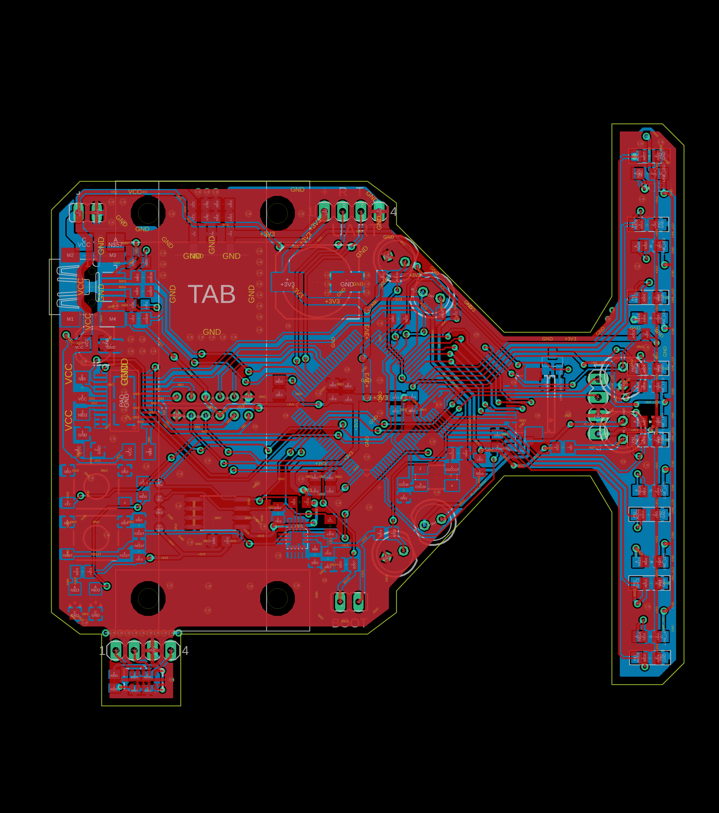
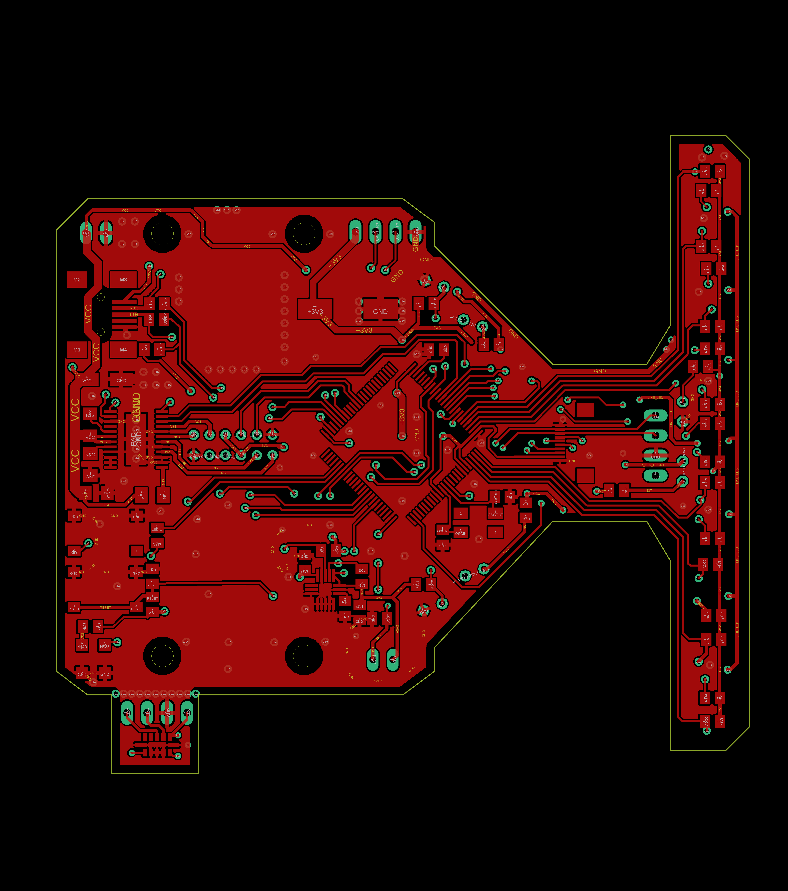
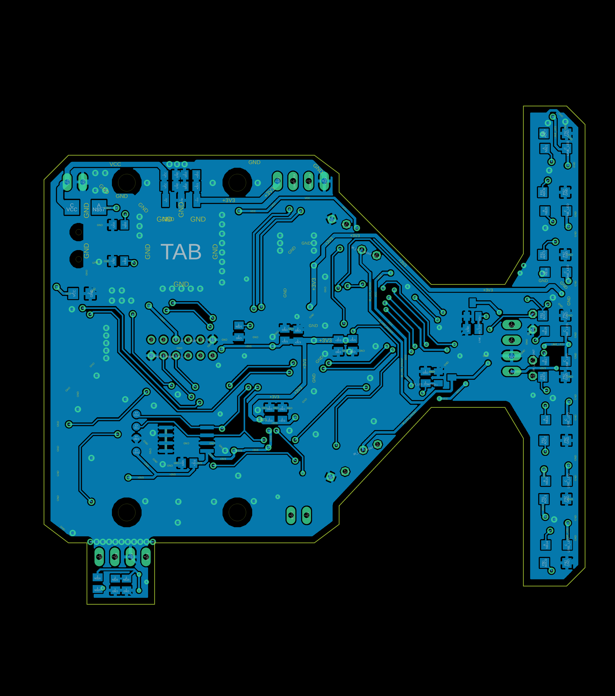

# motoko uprising new
motoko uprising line following robot,

**highlights**
- cpu stm32f7, 216MHz ARM Cortex M7
- DRV8834, TI motor driver
- 8x phototransistor + white led as line sensor
- IR leds for obstacle detection
- 2x pololu motors HP, 1:30 with encoder
- expansion : camera, laser sensor

- custom operating system
- reccurent LSTM in controll loop
- total 3 other PIDs used




# structure
 
 * src
    * firmware - robot main firmware
    * robot_debug_py - debug application
    * AI gym env for reinforcement learning [gym-line_follower](src/gym-line_follower/)
    * TODO rl_line_follower [rl_line_follower](src/rl_line_follower/)

* hardware 
    * eagle files [hardware](hardware/)
    * gerber outputs [files](hardware/CAMOutputs/)
    * stl for 3D printed parts [files](hardware/mechanical/)

# supervised learning for line position prediction

**key points**
* **input**  is time series sequence from 8 line sensors
* **output** is classification into three classes (left, straight, righ)
* RNN GRU with 64 units used, and linear layer with 3 neurons

* confusion matrix result for **float32**
```bash
accuracy   = 89.037 [%]
hit_count  = 116703
miss_count = 14369

class_accuracy = 90.952%   90.474%   84.811%   


confusion_matrix = 
       28326        1376           8
        2817       57907        5448
           0        4720       30470
```

* confusion matrix result for **int8** quantization

```bash
testing result
accuracy   = 87.792 [%]
hit_count  = 115071
miss_count = 16001

class_accuracy = 79.176%   91.345%   87.918%   


confusion_matrix = 
       22858        3566           0
        6011       62800        4041
           0        2383       29413
```




# reinforcement learning in Pybullet ENV

**key points**
* **state** is 256 last line positions, motors velocities, and line present flag

* PPO algorithm for continuous action space

* GRU model with three output heads (mean, variance, value)




# hardware










